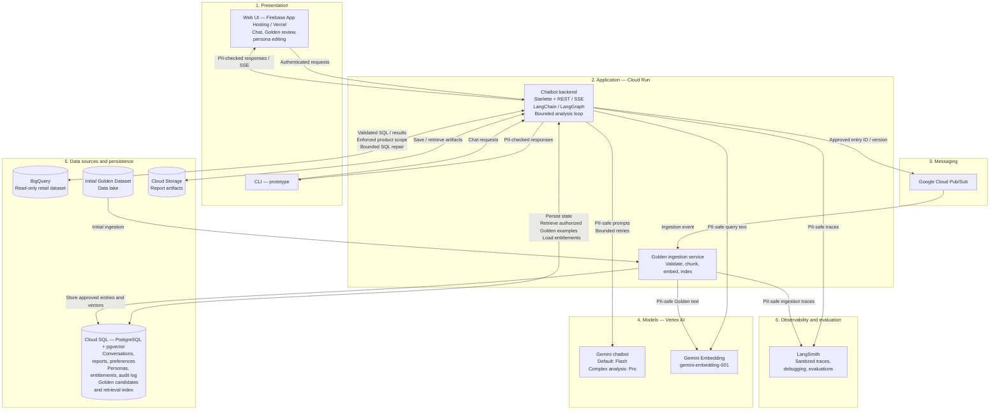

```mermaid
flowchart TB
    subgraph Clients["1. Presentation"]
        UI["Web UI — Firebase App Hosting / Vercel
        Chat, Golden review, persona editing"]
        CLI["CLI — prototype"]
    end

    subgraph Application["2. Application — Cloud Run"]
        Backend["Chatbot backend
        Starlette + REST / SSE
        LangChain / LangGraph
        Bounded analysis loop"]
        Ingestion["Golden ingestion service
        Validate, chunk, embed, index"]
    end

    subgraph Messaging["3. Messaging"]
        PubSub["Google Cloud Pub/Sub"]
    end

    subgraph AI["4. Models — Vertex AI"]
        Chat["Gemini chatbot
        Default: Flash
        Complex analysis: Pro"]
        Embedding["Gemini Embedding
        gemini-embedding-001"]
    end

    subgraph Data["5. Data sources and persistence"]
        BigQuery[("BigQuery
        Read-only retail dataset")]
        Postgres[("Cloud SQL — PostgreSQL + pgvector
        Conversations, reports, preferences
        Personas, entitlements, audit log
        Golden candidates and retrieval index")]
        Golden[("Initial Golden Dataset
        Data lake")]
        Storage[("Cloud Storage
        Report artifacts")]
    end

    subgraph Operations["6. Observability and evaluation"]
        LangSmith["LangSmith
        Sanitized traces, debugging, evaluations"]
    end

    UI -->|"Authenticated requests"| Backend
    CLI -->|"Chat requests"| Backend
    Backend -->|"PII-checked responses / SSE"| UI
    Backend -->|"PII-checked responses"| CLI

    Backend -->|"Approved entry ID / version"| PubSub
    PubSub -->|"Ingestion event"| Ingestion

    Backend -->|"PII-safe prompts
    Bounded retries"| Chat
    Backend -->|"PII-safe query text"| Embedding
    Ingestion -->|"PII-safe Golden text"| Embedding

    Backend <-->|"Validated SQL / results
    Enforced product scope
    Bounded SQL repair"| BigQuery

    Backend <-->|"Persist state
    Retrieve authorized Golden examples
    Load entitlements"| Postgres

    Golden -->|"Initial ingestion"| Ingestion
    Ingestion -->|"Store approved entries and vectors"| Postgres
    Backend <-->|"Save / retrieve artifacts"| Storage

    Backend -->|"PII-safe traces"| LangSmith
    Ingestion -->|"PII-safe ingestion traces"| LangSmith
```