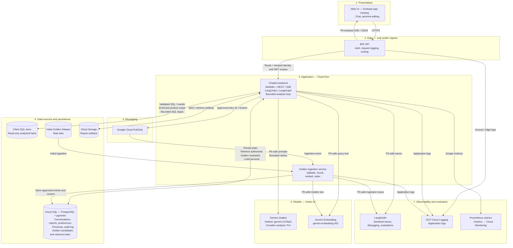

```mermaid
flowchart TB
    subgraph Clients["1. Presentation"]
        UI["Web UI — Firebase App Hosting
        Chat, persona editing"]
    end

    subgraph Edge["2. Edge — only public ingress"]
        BFF["BFF API
        Auth, request logging, routing"]
    end

    subgraph Application["3. Application — Cloud Run"]
        Backend["Chatbot backend
        Starlette + REST / SSE
        LangChain / LangGraph
        Bounded analysis loop"]
        Ingestion["Golden ingestion service
        Validate, chunk, embed, index"]
    end

    subgraph Messaging["4. Messaging"]
        PubSub["Google Cloud Pub/Sub"]
    end

    subgraph AI["5. Models — Vertex AI"]
        Chat["Gemini chatbot
        Default: gemini-3.8-flash
        Complex analysis: Pro"]
        Embedding["Gemini Embedding
        gemini-embedding-001"]
    end

    subgraph Data["6. Data sources and persistence"]
        Analytics[("Client SQL store
        Read-only analytical facts")]
        Postgres[("Cloud SQL — PostgreSQL + pgvector
        Conversations, reports, preferences
        Personas, audit log
        Golden candidates and retrieval index")]
        Golden[("Initial Golden Dataset
        Data lake")]
        Storage[("Cloud Storage
        Report artifacts")]
    end

    subgraph Operations["7. Observability and evaluation"]
        LangSmith["LangSmith
        Sanitized traces, debugging, evaluations"]
        CloudLogging["GCP Cloud Logging
        Application logs"]
        Metrics["Prometheus metrics
        /metrics → Cloud Monitoring"]
    end

    UI -->|"HTTPS"| BFF
    BFF -->|"PII-checked SSE / JSON"| UI
    BFF -->|"Route + forward identity and JWT scopes"| Backend

    Backend -->|"Approved entry ID / version"| PubSub
    PubSub -->|"Ingestion event"| Ingestion

    Backend -->|"PII-safe prompts
    Bounded retries"| Chat
    Backend -->|"PII-safe query text"| Embedding
    Ingestion -->|"PII-safe Golden text"| Embedding

    Backend <-->|"Validated SQL / results
    Enforced product scope
    Bounded SQL repair"| Analytics

    Backend <-->|"Persist state
    Retrieve authorized Golden examples
    Load persona"| Postgres

    Golden -->|"Initial ingestion"| Ingestion
    Ingestion -->|"Store approved entries and vectors"| Postgres
    Backend <-->|"Save / retrieve artifacts"| Storage

    Backend -->|"PII-safe traces"| LangSmith
    Ingestion -->|"PII-safe ingestion traces"| LangSmith
    BFF -->|"Access / edge logs"| CloudLogging
    Backend -->|"Application logs"| CloudLogging
    Ingestion -->|"Application logs"| CloudLogging
    Backend -->|"Scrape /metrics"| Metrics
```
