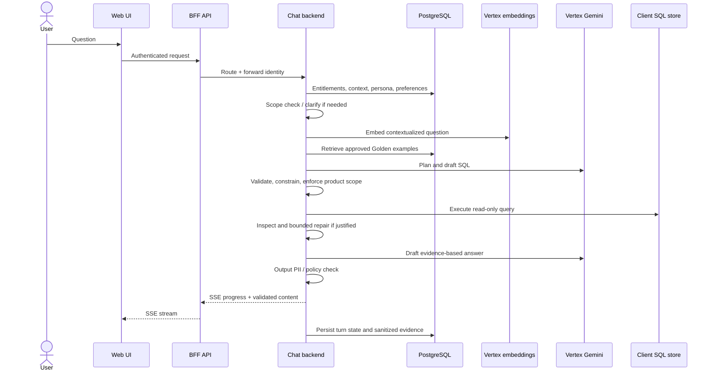
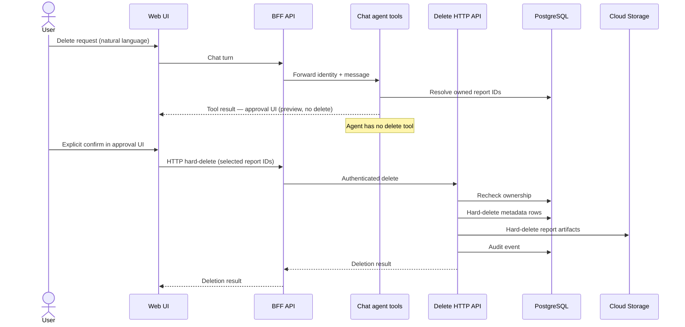
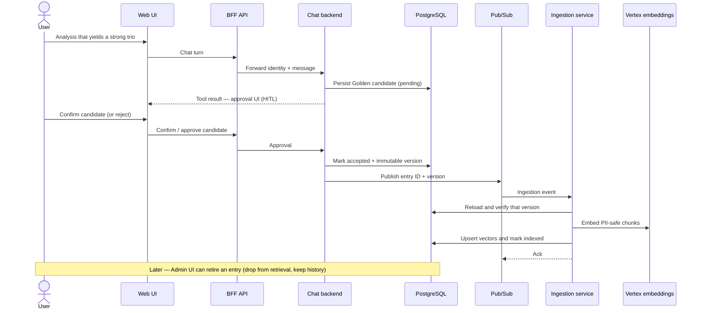
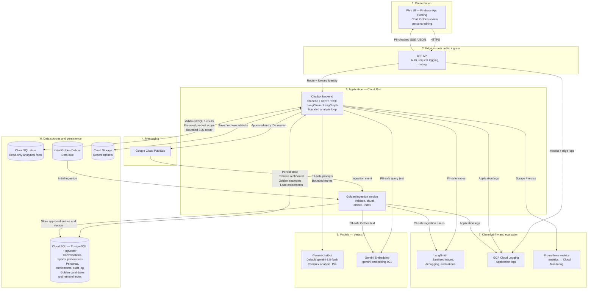

# High-Level Design: Retail Data Analysis Chatbot

This document describes the design for the retail data analysis assistant. Setup and implementation notes are in `readme.md`.

---

## 1. Purpose, scope, and assumptions

This system lets non-technical executives ask natural-language questions about sales, inventory, and performance, then receive evidence-based answers and reports. It combines a read-only analytical store with reviewed Golden set of analyst examples, and it must stay within product entitlements, refuse non-analytical work, and keep raw PII out of model inputs and released outputs.

**Features in scope:** 
- authenticated chat analysis,
- saved-report snapshots lifecycle with deletion confirmation,
- Golden set retrieval,
- Golden set candidates approval & addition,
- persona editing for authorized non-developers (single instance with change history)
- and the operational controls needed to run the system.

**Out of scope, but possible future additions:**
- reusable report templates instead of stored snapshots,
- multiple selectable personas

**Assumptions:**
- users are entitled to a defined set of products/brands, stored as a user-role-to-entitlement mapping in PostgreSQL (for example role `brand-calvin` → brands `["Calvin Klein"]`; admin → all brands)
- additional entitlements might be introduced (not only brand-based)
- analytical facts come from a **read-only SQL data store provided by the client** (schema and entitlements defined with the client; not tied to a specific warehouse SKU) 

---

## 2. Core user flows

### 2.1 Analysis request

An authenticated request resolves entitlements, loads conversation context, preferences, and the active persona, then decides whether the ask is in analytical or report-management scope.

The full agent turn is as follows:
- retrieve a small set of approved Golden Set examples,
- plan and generate SQL,
- SQL validation in deterministic application code,
- SQL execution against the client-provided analytical store,
- result inspection and possible bounded repairs
- writing an evidence-based answer that is PII-checked before stream or return.

Treat “plan → query → inspect → refine → report” as one logical workflow with budgets (tool calls, SQL repairs, tokens, turn deadline). Ambiguous business definitions get a clarification question, and claims of the chatbot should always be based on data, with proper provenance included.

Reports will be saved as HTML artifacts for ease of debugging and better results when it comes to LLM generation compared to PDF.

### 2.2 Confirmed report deletion

Report removal is a destructive action, and as such should be an application-controlled workflow. When the user requests to delete a report, the chatbot can resolve the report in question and should show an approval UI (frontend component shown via a tool call), which, upon approval, should call an HTTP endpoint to **hard-delete** the report: remove the PostgreSQL metadata row and permanently delete the Cloud Storage artifact (no soft-delete / tombstone). The agent should never have access to delete the report directly.

### 2.3 Golden set and learning

Part of the analysis loop is deciding whether a given analysis topic is a good candidate for the Golden Set - so a report generated based on a question, together with it's SQL Query. When a candidate has been identified, it is saved in the PostgreSQL database and a dedicated UI is being shown to the user, similarly to report deletion confirmation. Once a candidate has been confirmed, it is being added to the Pub/Sub and subsequently ran through embedding and saved in pgVector, and the candidate status is changed to accepted. Ingestion implementation must provide idempotency and retries.

The candidate record includes the Question/SQL/Report trio as well as metadata such as used model, user, provenance. 

Once an entry has been retired (through a dedicated UI), it is dropped out of retrieval immediately, but history is kept.

At query time the Chatbot Service embeds a contextualized question with the same model and dimensions as the index, filters to approved and in-scope entries, retrieves a small budgeted set, and treats those examples as methodology — then generates fresh SQL under the same security controls. User preferences are stored with provenance and used as part of the context as well.

### 2.4 Persona management

Authorized non-developers edit presentation and tone in the admin UI. PostgreSQL stores versions, author, timestamps, and which configuration is active for audit purposes. There is only one global persona active at any given time. The persona prompt is deprioritized so that it can only affect the tone, and not any other parts of the system prompt.

Each analysis records the persona version it used. 

---

## 3. Architecture and technology rationale

The general setup will be a Next.js web UI, connected to a BFF API, responsible for user authentication, request logging and routing to the proper service. This ensures proper separation of concerns as well as extensibility for the future.  BFF is the only service reachable from outside of the network.

Behind this BFF there will be two main services - the Chatbot service, which will hold majority of the logic for the user flows - orchestrating a bounded LangGraph analysis loop for the chatbot, Golden Set examples retrieval, persona injection, persisting user reports etc. The other service would be the Indexing Service, responsible for initial indexing of the Golden Set, as well as ongoing ingestion of new approved candidates. All backend services will be running Python/Starlette on Cloud Run.

Google Pub/Sub is used for queuing of the Golden Set items for indexing, Indexing Service drains this queue.

The Next.js web UI is hosted on **Firebase App Hosting** so the frontend stays in the same Google Cloud estate as Cloud Run, IAM, and the rest of the stack.

User report snapshot files will be persisted in Cloud Storage.

For agent observability, a managed LangSmith service is used for traces and evaluations.

Application logs use the standard Python ``logging`` API. The sink is the **Cloud Logging handler** (GCP Cloud Logging).

Persistent storage is delivered via CloudSQL PostgreSQL database with pgvector for Golden Set embeddings.  

Cloud Run is the baseline compute choice because both the chat API and Golden ingestion are independently scalable HTTP or event-driven services with all durable state outside the process.

Vertex API is chosen as the managed Gemini offering, due to alignment with other GCP services we are using, IAM integration and service accounts, ops alignment and enterprise data handling.

**Model strategy:** Default chat model ID is **`gemini-3.8-flash`** as an optimized tradeoff between speed, quality and price. A Gemini Pro SKU remains available as a configurable upgrade for complex analysis via Vertex. Embeddings use **`gemini-embedding-001`** at 768 dimensions, subject to retrieval evaluation.

---

## 4. Data and state model

PostgreSQL is the application system of record:
- User product entitlements,
- Conversation checkpoints,
- User preferences records,
- Persona versions,
- Report metadata and object references,
- Golden set candidates,
- Retrieval vectors
- Audit log

Cloud Storage holds report artifacts.
A read-only **SQL data store provided by the client** holds analytical facts. The chatbot never writes to it. Access is via least-privilege SQL credentials, allowlisted tables, and deterministic entitlement rewriting.

A saved report is a snapshot: original question, SQL, execution timestamp, and the persona / prompt / Golden set items, as well as the pointer to the artifact in Cloud Storage. 

---

## 5. Security and governance

Authentication will be resolved via a JWT token on BFF. The user data will be forwarded to the further layers from that point on without the need for authentication.

Every analytical query — including joins, subqueries, and customer/order cuts — must have allowed-product scope injected and verified in application data-access code - this is not controlled by the LLM, but added deterministically based on the user's entitlement mapping in PostgreSQL (e.g. after JWT auth, load brands for that user such as `Calvin Klein` or `Levi's`, then rewrite SQL on `products` / `order_items` accordingly).

SQL is restricted to approved read-only operations, tables, columns, and functions, using least-privilege credentials, cost limits, timeouts, and bounded result sizes.

Raw PII stays out of model and embedding inputs by default, sanitized inputs are phone and email (as per the requirements shared on Slack).
User text, retrieved examples, tool results, errors, and traces are all sanitized. Final answers and LLM-generated artifacts are checked before release as well.

Persona/tone configuration cannot change security rules - those are deterministic application code and/or backed in system prompt that always takes precedence over the Persona prompt.

**Non-analytical work.** The assistant is allowed only retail analysis and saved-report library operations. We enforce this as **system-prompt policy** (refuse jokes, coding help, jailbreaks, etc.; do not call analysis tools) and **eval cases** that score refusal + no `run_sql`.

---

## 6. Reliability, scalability, deployment, and recovery

Transient provided failures get limited retries with backoff. If the limit is exceeded, the conversation state is preserved and an error is shown, with manual retry possibility. 

SQL errors and empty result sets are detected in application code on the SQL tool path. The tool returns a structured ``repair_required`` (or ``empty_result_exhausted``) payload; the agent may rewrite and retry within a per-turn empty-result budget so costs stay bounded.

The initial LangGraph **recursion limit is 50** steps per turn, and the initial **per-turn Vertex cost ceiling is USD 1.00**. Both are configuration and can be adjusted once real usage (typical tool-call depth and spend) is known. 

The database should be backed up daily automatically in GCP.

---

## 7. Evaluation and observability

Evaluation should be a part of the development flow as well as a periodical gate to check system health (e.g. in a case of model changes done by the provider). Evaluation should be done via an llm-as-a-judge setup, linked to LangSmith. The test cases should cover:
- Regular analysis,
- Generated SQL queries,
- Golden set usage,
- Golden set candidate proposals,
- User preference candidates,
- Artifact creation,
- Numerical consistency,
- PII exclusion,
- Report deletion confirmation,
- Tool use (in case of extensions)

The eval set should be extended whenever a new use case is identified and implemented, and should be refined and extended during the QA phase before deploying the system.

**Judge model:** **ChatGPT 5.1 sol**, so the judge is a different family from the Gemini agent and confirmation bias is less plausible.

For algorithmic parts of the system, unit tests and end to end tests will be implemented.

Live agent traces go to managed LangSmith. Trace payloads must remain PII-safe (email and phone scrubbed) before export.

Application logs (request/auth failures, turn lifecycle, tool start/end, retries, unhandled errors) use Python ``logging`` with the **Cloud Logging handler**. Prefer logging identifiers (``user_id``, ``conversation_id``, tool names) rather than raw user message text.

Mutating user actions — report creation and confirmed deletion, Golden set candidate accept/reject, persona activation — are also written to the PostgreSQL **audit log** (actor, action, resource, timestamp) so they can be reconstructed independently of application logs and traces.

Agent-level metrics (turn latency/error rate, tool ok/error, SQL query outcomes including empty/exhausted, model retries, report delete confirm/cancel, auth failures) are exposed via Prometheus at ``GET /metrics`` from a dedicated metrics module. That endpoint is scraped into **Cloud Monitoring** (Managed Prometheus).

---

## 8. Extensibility

New capabilities (charts, email, extra sources) should attach as tools or services behind the same auth, budget, and PII gates. The architecture also allows for additional services to be added in case of larger features (e.g. an Email Service).

---

## 9. Service inventory

| Part | Service to provision |
| --- | --- |
| Web UI (chat, Golden review, persona editing) | **Firebase App Hosting** (Next.js) |
| BFF (auth, request logging, routing — only public ingress) | **Cloud Run** |
| Chatbot backend (Starlette, SSE, LangGraph loop) | **Cloud Run** |
| Golden ingestion / indexing | **Cloud Run** |
| Golden ingest queue | **Pub/Sub** |
| Chat / analysis LLM | **Vertex AI** — `gemini-3.8-flash` (Pro as optional upgrade) |
| Embeddings | **Vertex AI** — `gemini-embedding-001` |
| Analytical facts (read-only) | **SQL data store provided by the client** |
| App state, entitlements, personas, Golden vectors | **Cloud SQL PostgreSQL** with **pgvector** |
| Report HTML artifacts | **Cloud Storage** |
| Initial Golden corpus | Object store / data lake (ingested into Postgres) |
| Identity & least-privilege access | **Cloud IAM** (service accounts) |
| Agent traces and eval experiments | **LangSmith** |
| LLM-as-judge | **ChatGPT 5.1 sol** |
| Application / edge logs | **Cloud Logging** (Python Cloud Logging handler) |
| Agent metrics scrape | **Cloud Monitoring** (Managed Prometheus) against `/metrics` |
| Database backups | **Cloud SQL** automated backups |

---

## 10. Trade-offs, risks, and requirement coverage

**Risk — unauthorized product leakage via model-written SQL.** The LLM may emit SQL that omits brand filters, joins through unscoped tables, or otherwise returns rows outside the caller's entitlements (e.g. a Calvin Klein user seeing Levi's revenue). Prompt instructions alone are not a control. **Remediation:** every query passes through deterministic application SQL validation before SQL — allowlisted read-only statements and tables only, then entitlement scope is **injected/rewritten** in code from the PostgreSQL mapping (not trusted from the model). Invalid or unscoped SQL is rejected; the agent may repair within budget, but execution never bypasses the guard. Least-privilege SQL credentials, bytes/row caps, and brand-auth evals further reduce residual risk.

| Trade-off | Default choice | Alternative |
| --- | --- | --- |
| Web UI hosting | Firebase App Hosting (GCP-aligned) | **Vercel** if the client already runs Next.js there — same BFF/API contract; only the frontend deploy target changes |
| Compute | **Cloud Run** (managed scale, less ops) | **Kubernetes** is a future option only if concrete requirements (custom networking, sidecars, multi-service scheduling) justify the operational overhead. Keep this option in mind during implementation. |
| Chat model | **`gemini-3.8-flash`** — lower cost and lower latency | Gemini **Pro** for harder analyses — higher quality at higher cost and slower responses |

**Open question:** backup **RPO/RTO** targets once the client sets acceptable data-loss and recovery-time budgets (daily Cloud SQL backups are the baseline until then).

**Future consideration — analysis continuing after SSE disconnect.** If product later needs long-running analyses to outlive the HTTP/SSE connection, add a durable worker (Cloud Run job / worker + queue) so work continues, progress is persisted, and the client resumes from chat history. Until then, analysis runs in the chatbot request/SSE path.

| Assignment requirement | Design section |
| --- | --- |
| Hybrid intelligence / Golden retrieval and updates | 3.1, 3.3, 6 |
| Safety, PII masking, product-scoped analysis | 5 |
| Saved reports and confirmed deletion | 3.2, 4 |
| User-level preference learning | 6 |
| System-level learning loop | 6 |
| Resilience and graceful error handling | 3.1, 8 |
| Quality assurance / evaluation | 7 |
| Observability and debugging | 7 |
| Persona management without redeploy | 2.4 |
| Architecture, services, and data stores | 3, 4, 9 |
| Technology rationale | 3 |
| Extensibility (new tools / sources) | 8 |
| Client analytical SQL store (read-only) | 1, 4, 5, 9 |
| Requirement coverage / open items | 10 |

